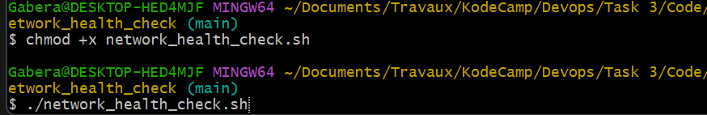
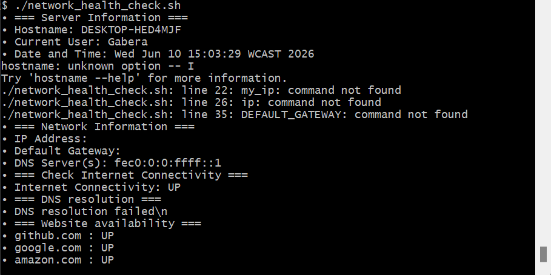

This shell program display the state of the network with the details. It also generates a text file containing all this information.  
In the following, we will see, step by step, how to run this program and its results. 
Step 1: Run the program  
First we open Git bash and change the directory to the place where network_health_check.sh is.  

  
   
  <em>Figure 1:Here we enter the commands to execute the file </em>

Step 2: Analyse the result  
Once the program is run, we see the server information, network information, Internet connectivity, DNS resolution, website availability 

  
   
  <em>Figure 2: Here we see the results </em>

Step 3: Retrieve the generated report file 
The generated report file is in the same directory of network_health_check.sh. It contains all what was mentioned. 

  
   
  <em>Figure 3: place of network_report_file </em>

  
   
  <em>Figure 4: Content of network_report_file </em>

